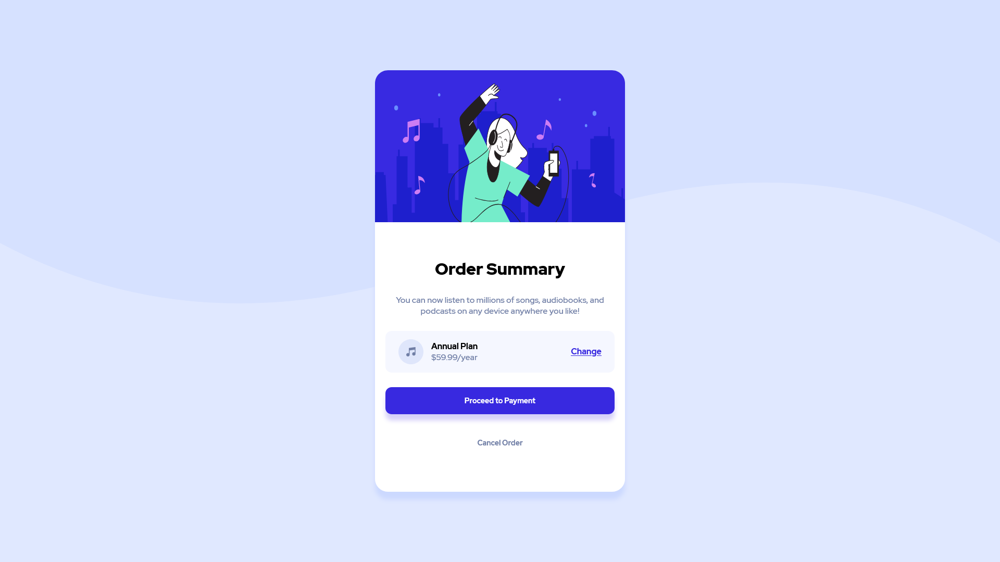
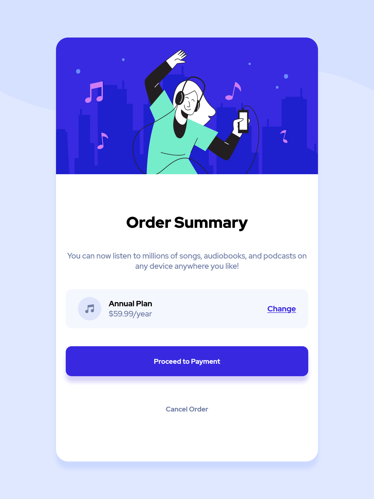
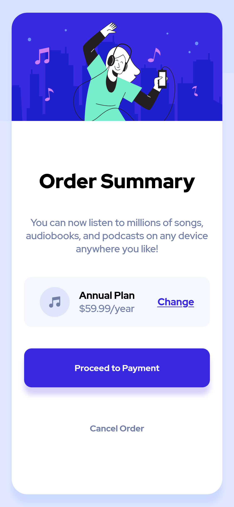

# Frontend Mentor Order Summary Solution

This is a solution to the [Order summary card challenge on Frontend Mentor](https://www.frontendmentor.io/challenges/order-summary-component-QlPmajDUj).

## Table of Contents:

## Overview

### Screenshots

- #### 1920x1080

- ### 768x1024

- ### 375x812

### Links

- Solution URL: https://github.com/Darshan-Bajeja/frontendmentor-order-summary
- Live Site: https://Darshan-Bajeja.github.io/frontendmentor-order-summary

## Process

### Built With

- HTML
- CSS
- Flexbox
- Media Queries

### Resources Used

- [w3Schools](https://w3schools.com)
- [stackoverflow](https://stackoverflow.com)

## Author

- Github: [@Darshan-Bajeja](https://github.com/Darshan-Bajeja)
- Frontend Mentor: [@Darshan-Bajeja](https://frontendmentor.io/profile/Darshan-Bajeja)
